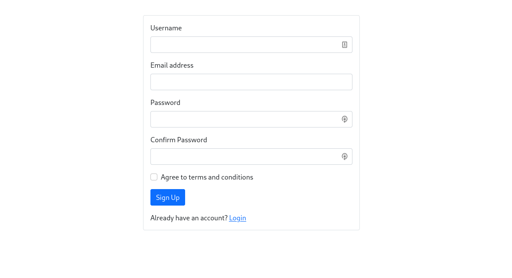

# [TheOdinProject](https://www.theodinproject.com/)

Project: Members-Only

A session based authentication CRUD message board with registration and login function. Included Sanitization and Input validation to enhance security and provide seamless user interface.

Using [Bootstrap 5](https://getbootstrap.com/) to write All CSS

## Features

- Full CRUD functionality
- Login and register
- User authentication
- HTML sanitization

## Installation

This app uses environment variables and is not meant to be installed. Please visit the demo site or view source code to know more about details.

## Demo

[Live Demo](https://illusion-9503.herokuapp.com/)
